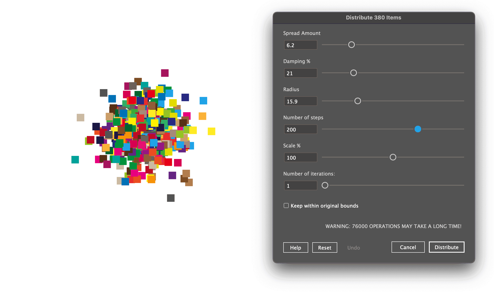
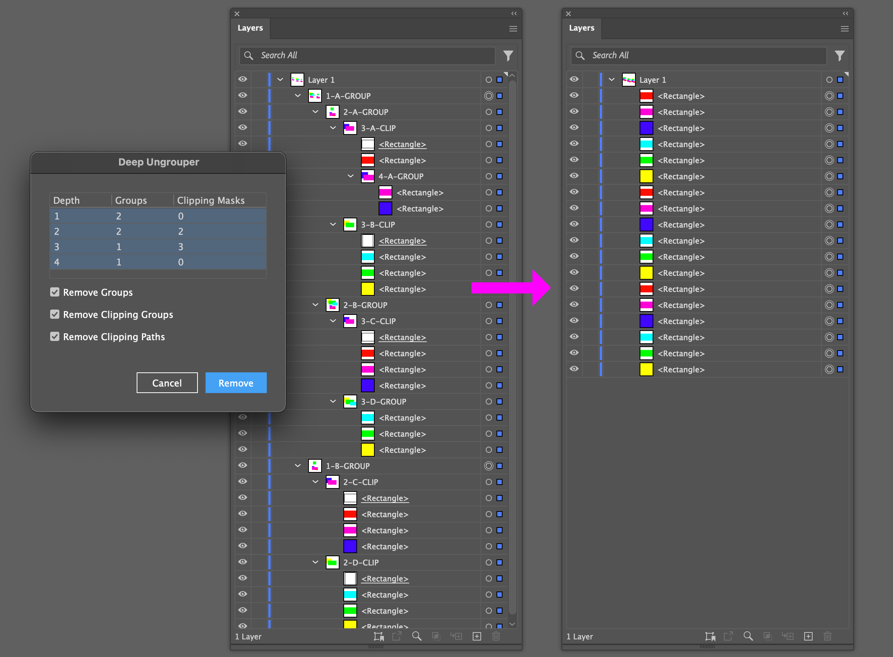
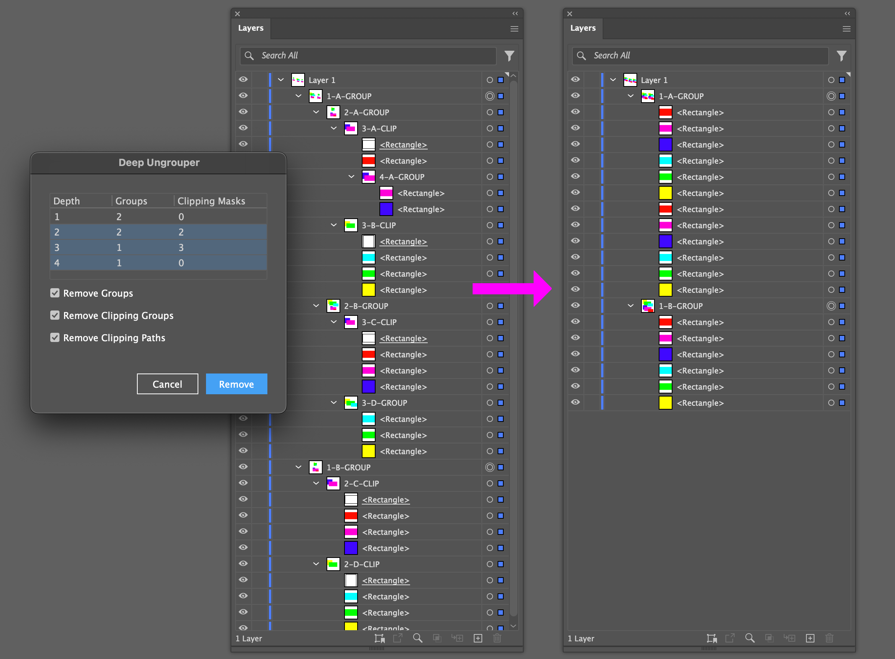
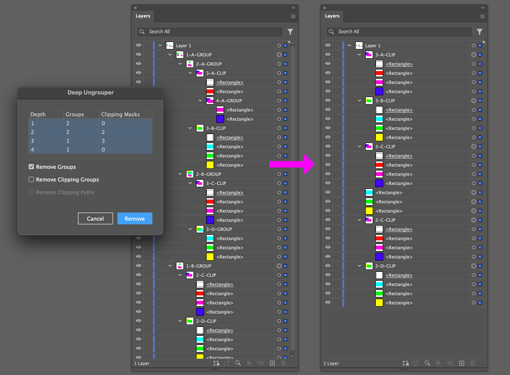
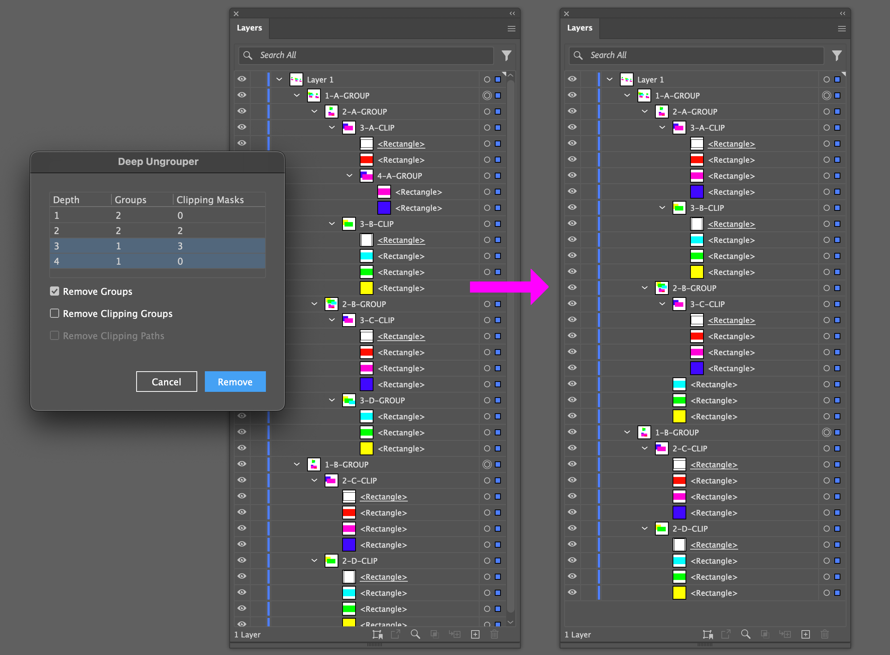
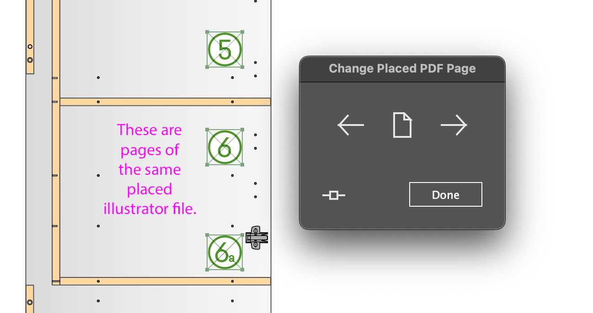

# Scripts for Adobe Illustrator

Some scripts I've written to do useful things in Adobe Illustrator.

## Contents

1. [Distribute Items](#distribute-items)
1. [Deep Ungrouper](#deep-ungrouper)
1. [Page Switcher](#page-switcher)

---

## Distribute Items

         

Adjusts the spacing between selected page items, using several parameters.

1. Adjust parameters:
   - **Spread Amount**: The amount of spreading force applied.
   - **Damping %**: A scaling factor applied to the spread force at each step.
   - **Radius**: Items further apart than this value, in points, will be ignored.
   - **Number of Steps**: More steps give a more even, settled, distribution, but take longer to calculate.
   - **Scale %**: A scaling factor applied to the point distribution. 100% means no extra scaling.
   - **Number of Iterations**: The number of times the distribution algorithm is re-applied to the points. Often 1 is enough, but higher values can be very effective when `keepWithinBounds` is true.
   - **Keep Within Bounds**: Whether to scale the distributed points to maintain the original points\' bounds.

1. Click **Distribute** button to perform the distribution.
   - You can perform multiple distributions, one-after-another, or clicking the **Undo** button to revert.
   - Click **Help** button to see the parameter descriptions.
   - Click **Reset** button to revert parameters to defaults.
   - Caution: some parameters settings, such as a high **number of iterations** will be very slow.

---

## Deep Ungrouper

         

Script allows the removal of groups, including clipping groups and masks, at specified depths of nesting.

One use case is cleaning up dirty imported content with ludicrously redundant grouping and clipping.

#### Example 1

Removing all groups and clipping masks at all depths:

#### Example 2

Removing all groups and clipping masks except the top level groups:

#### Example 3

Removing *only* groups at all depths:

#### Example 4

Removing groups at depths 3 and 4:

---

## Page Switcher

         

A simple interface to change the page of a multi-page placed .pdf or .ai file.

Just select the placed graphics, run the script and click forward or backwards to switch pages.

---

## Installation

Step 1: Download the individual scripts (see buttons under script names), or
[-*_FREE!_*-F50?style=flat-square)](https://github.com/mark1bean/scripts-for-adobe-indesign/archive/refs/heads/main.zip)

(Note: If the script shows as raw text in the browser, save it to your computer with the extension ".js".)

Step 2: Expand the zipped file and move the downloaded scripts to Illustrator's scripts folder.

See [How To Install Scripts in Adobe Illustrator](https://creativepro.com/how-to-install-scripts-in-adobe-illustrator).

---

## Author

Created by Mark Bean (Adobe Community Expert "[m1b](https://community.adobe.com/t5/user/viewprofilepage/user-id/13791991)").

If any of these scripts will save you time, please consider supporting me!

---

## License

These scripts are open-source and available under the MIT License. See the [LICENSE](LICENSE) file for details.
