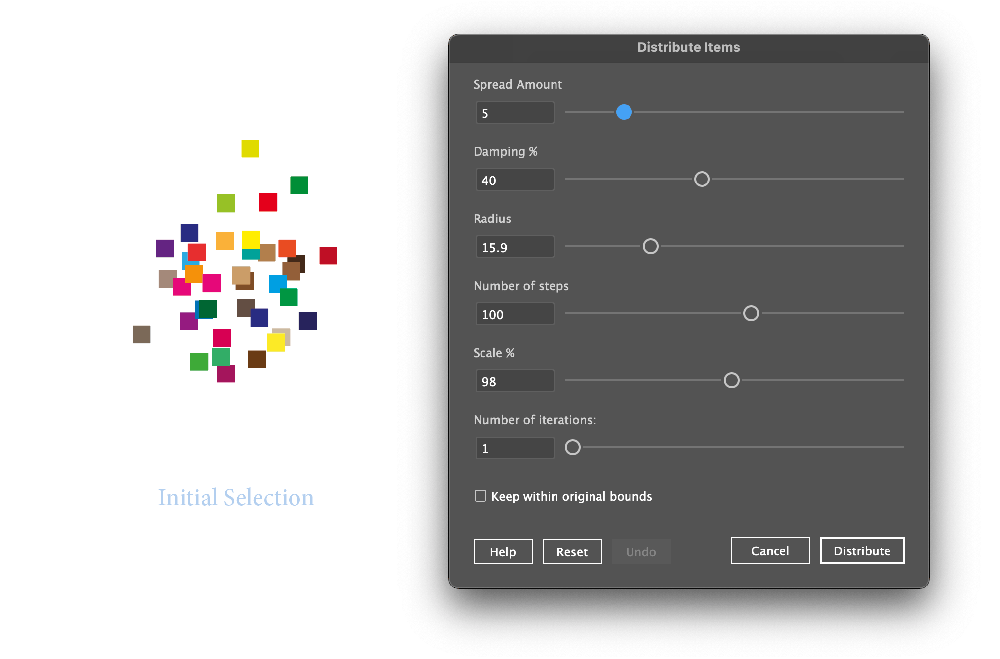

# Scripts For Adobe Illustrator

Various (hopefully!) useful scripts for Adobe Illustrator.

This repository contains the following scripts. I will be adding new scripts from time to time.

## [Distribute Items.js](./distribute-items/README.md)

Adjusts the spacing between selected page items, using several parameters.

---

## Show your support

If any of these scripts will help you, please consider supporting me:

---

## Installation

#### Step 1: Download the scripts

To install this script, first download this repository (zipped):

#### Step 2: Place the scripts in the appropriate folder

Expand the zipped file and move the downloaded scripts to Illustrator's scripts folder.

See [How To Install Scripts in Adobe Illustrator](https://creativepro.com/how-to-install-scripts-in-adobe-illustrator).

See each individual script's READ ME for specific information.

---

## Author

All scripts here were created by Mark Bean ("[m1b](https://community.adobe.com/t5/user/viewprofilepage/user-id/13791991)"). See the individual scripts READ ME document for additional acknowledgements.

## License

This project is open-source and available under the MIT License. See the [LICENSE](LICENSE) file for details.