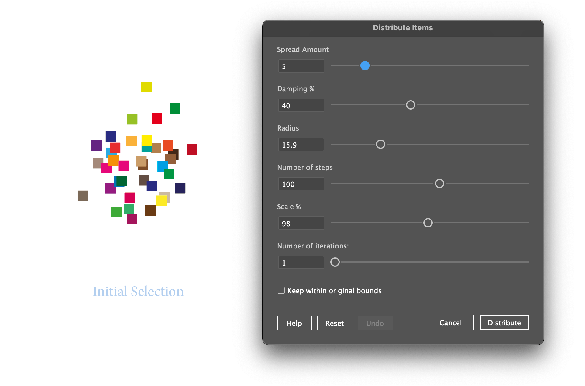

# Distribute Items script for Illustrator

Adjusts the spacing between selected page items, using several parameters.

## Show your support

If this script will help you, please consider supporting me:

---

## Installation

#### Step 1: Download the scripts

To install this script, first download the repository (zipped):

#### Step 2: Place the scripts in the appropriate folder

Expand the zipped file and move the downloaded scripts to Illustrator's scripts folder.

See [How To Install Scripts in Adobe Illustrator](https://creativepro.com/how-to-install-scripts-in-adobe-illustrator).

#### Step 3: Run the Script

1. Open your Adobe Illustrator or InDesign application.
1. Select the items you want to distribute.
1. Choose `File > Scripts` menu and choose `Distribute Items`.

---

## Usage

1. Experiment with the parameters:
   - **Spread Amount**: The amount of spreading force applied.
   - **Damping %**: A scaling factor applied to the spread force at each step.
   - **Radius**: Items further apart than this value, in points, will be ignored.
   - **Number of Steps**: More steps give a more even, settled, distribution.
   - **Scale %**: A scaling factor applied to the point distribution. 100% means no extra scaling.
   - **Number of Iterations**: The number of times the distribution algorithm is re-applied to the points. Usually 1 is enough, but higher values can be very effective when `keepWithinBounds` is true.
   - **Keep Within Bounds**: Whether to scale the distributed points to maintain the original points\' bounds.

1. Click **Distribute** button to perform the distribution.
   - You can perform multiple distributions, one-after-another, or clicking the **Undo** button to revert.
   - Click **Help** button to see the parameter descriptions.
   - Click **Reset** button to revert parameters to defaults.
   - Caution: some parameters settings, such as a high **number of iterations** will be very slow.

1. Press **Escape** or **Cancel** to finish.

---

## Author

Created by Mark Bean ("[m1b](https://community.adobe.com/t5/user/viewprofilepage/user-id/13791991)"). Inspired by [this community discussion](https://community.adobe.com/t5/illustrator-discussions/overlapping-objects/m-p/14967266).

## Acknowledgements

I learned about the force/damping algorithm using ChatGPT 4o. I tried to find a human source for it, but failed. I modified it a lot for my purposes anyway.

## License

This project is open-source and available under the MIT License. See the [LICENSE](../LICENSE) file for details.